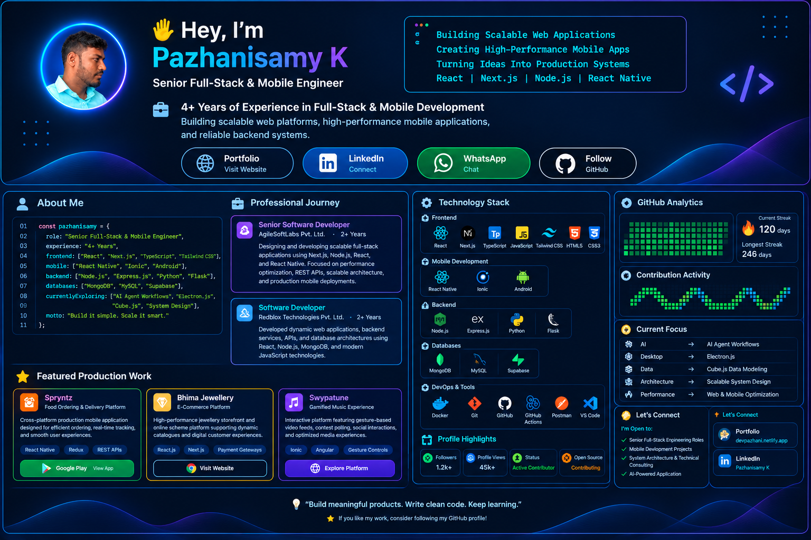

<div align="center">

# 👋 Hey, I'm Pazhanisamy K

### Senior Full-Stack & Mobile Engineer


<br/>

<p>
  <strong>4+ Years of Experience in Full-Stack & Mobile Development</strong>
</p>

<p>
Building scalable web platforms, high-performance mobile applications,
and reliable backend systems.
</p>

<br/>

<a href="https://devpazhani.netlify.app/">
  
</a>

<a href="https://www.linkedin.com/in/pazhanik">
  
</a>

<a href="https://api.whatsapp.com/send/?phone=6374657369&text=Hi%20Pazhanisamy">
  
</a>

<a href="https://github.com/pazhanisamyk">
  
</a>

</div>

---

## 🎬 Developer Introduction

<div align="center">



</div>

---

# 🧑‍💻 About Me

```ts
const pazhanisamy = {
  role: "Senior Full-Stack & Mobile Engineer",
  experience: "4+ Years",

  frontend: [
    "React",
    "Next.js",
    "TypeScript",
    "Tailwind CSS"
  ],

  mobile: [
    "React Native",
    "Ionic",
    "Android"
  ],

  backend: [
    "Node.js",
    "Express.js",
    "Python",
    "Flask"
  ],

  databases: [
    "MongoDB",
    "MySQL",
    "Supabase"
  ],

  currentlyExploring: [
    "AI Agent Workflows",
    "Electron.js",
    "Cube.js",
    "System Design"
  ],

  motto: "Build it simple. Scale it smart."
};
